[linkedin](https://www.linkedin.com/in/ga-belem/) &nbsp;·&nbsp;
[email](mailto:gabelem.moraes@gmail.com)

> CE student from Campinas - São Paulo 

My last project: 
[EnglishWell](https://www.englishwell.com.br/) &nbsp;·&nbsp; <samp>react native, expo, vercel</samp> 
A Portfolio for an English Teacher

<samp>c &nbsp; c++ &nbsp; python &nbsp; javascript &nbsp; html &nbsp; css &nbsp; git &nbsp; linux</samp>

**[instagram_sidebar](https://github.com/gabelem/instagram_sidebar)** &nbsp;·&nbsp; <samp>html, css</samp> 
Instagram Sidebar layout test 

